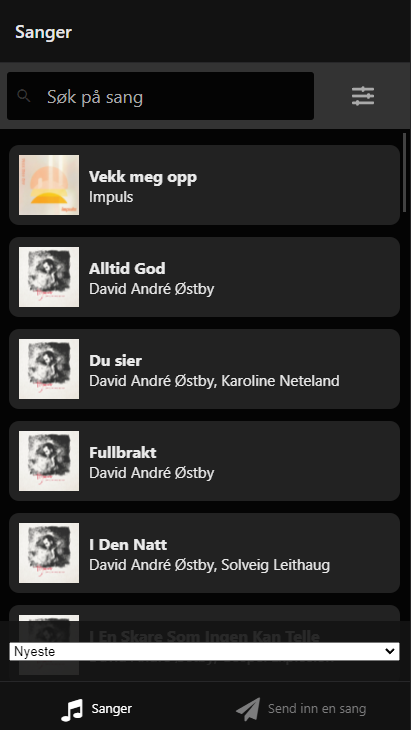
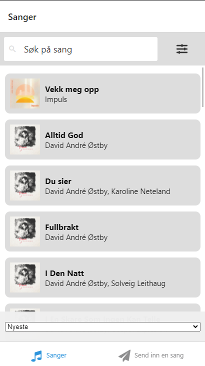

# Sangapp

Vi har valgt å lage en app i React Native basert på prosjekt 3 sin backend. Applikasjonen viser en liste av sanger hentet fra en database. Brukeren kan søke, filtrere og sortere sangene. Repositoriet inneholder også backenden, ettersom vi har gjort noen mindre endringer der.

## Kjøring av prosjektet

Prosjektet kan kjøres lokalt ved å klone repositoriet til egen maskin. Deretter kjøre en terminal i mappen 'react-native-client'. Her må man kjøre kommandoene `npm install` og så `npm run start`.

**NB:** Man trenger ikke å kjøre backenden lokalt, ettersom applikasjonen kobles til backenden som kjører på server. Det betyr at du må være tilkoblet NTNU sitt nettverk eller VPN for at sangene skal kunne lastes inn.

## Arkitektur

```
backend
└───src
    ├───models
    │   └───resolvers
    └───tests

react-native-client
├───.expo-shared
├───assets
└───src
    ├───components
    │   ├───generic
    │   ├───search
    │   ├───Songs
    │   └───SubmitSong
    │       ├───album
    │       └───song
    ├───hooks
    ├───navigation
    ├───redux
    │   └───filter
    ├───screens
    ├───styles
    ├───types
    └───utils
```

## Tekniske valg

### Brukergrensesnitt

Vi har valgt å bruke [React Native Elements](https://reactnativeelements.com/) for flere av UI-elementene våre, og for å gjøre konsekvent styling over hele applikasjonen lettere. I tillegg har vi brukt flere elementer fra [React Native Paper](https://callstack.github.io/react-native-paper/).

### Dark mode

Vi har implementert to theme-objekter som inneholder style-valg for eksempelvis layout og farger. Når appen starter sjekker vi om enheten er i mørk eller lys modus og angir at elementer fra react-native-elements skal bruke denne themen. Vi valgte å ikke implementere mørk modus med react-native-elements sin innebygde 'useDark' prop siden den ikke endret farger når vi byttet mellom mørk og lys modus. I tillegg gir dette oss mer fleksibilitet i fargevalg for hver modus.




For å sortere listen brukes native "pickers" for web, android og ios. Disse ser litt ulike ut. Det er derfor implementert en modal-versjon for IOS og en direkte aksess av pickeren for android og ios. Siden expo ikke setter CSS-attributtet "color-scheme: dark" på web er det satt to ulike tekstfarger på pickeren for web og android. Tekstfargen på web må altså være svart da color-scheme ikke pickeren derfor fortsatt får hvit bakgrunn.

### Oppdatering av backend

Det ble gjort noen endringer i backend, som blant annet å legge inn pagination for `artist` og `album`. I prosjekt 3 ble kun de første elementene fra `artist` og `album` hentet ut og vist i dropdown-listen, men ettersom vi fikk tilbakemelding på at dette var litt merkelig ettersom det var en drop-down-liste, så har vi også lagt inn infinite scroll når man velger Artist og Album og da var det nødvendig å oppdatere backend.

### Tydeliggjøring av "Opprett nytt album"

I prosjekt 3 hadde bruker mulighet til å opprette et nytt album med bilde. Denne funksjonen var likevel noe skjult, da man kun fikk opp muligheten dersom man ikke fant albumet man søkte etter. For å tydeliggjøre funksjonaliteten og gjøre det enklere og mer logisk for brukeren å kunne opprette et nytt album, så har vi lagt knappen for oppretting av album synlig hele tiden ved velging av album.

### Opplastning av bilde

Når man oppretter et nytt album får man muligheten til å legge til et coverbilde. Denne funksjonaliteten fungerer på Android, i iOS-emulator, men ikke på en iOS enhet. Vi vet ikke hvorfor dette skjer. Serveren mottar ihvertfall bildets filnavn, men det blir av en eller annen grunn ikke lagret.

### Implementering av to komponenter for DatePicker

Ettersom DatePicker(legg inn til hvilken pakke) kun fungerer på en "native" enhet, har vi opprettet en annen komponent for DatePicker som skal fungere på web. Begge komponentene har samme navn, men filnavnet inneholder `.native` for native-komponenten. React-Native velger da automatisk den komponenten som kan tilhører [enheten som brukes](https://reactnative.dev/docs/platform-specific-code#native-specific-extensions-ie-sharing-code-with-nodejs-and-web).

### Apollo client

I prosjekt 3 ble queries fra backend cachet i InMemoryCache'en til [Apollo client](https://www.apollographql.com/docs/react/). Vi hadde likevel brukt useEffect og useState hos React for å legge sammen resultatet fra queriene, noe som kunne vært løst mye enklere med `merge`-funksjonen man kan definere i InMemoryCache. I prosjekt 4 har vi derfor ryddet opp, slik at koden både blir mer leselig, benytter de innebygde funksjonene til Apollo og lagrer data i cachen på en ryddigere måte.
